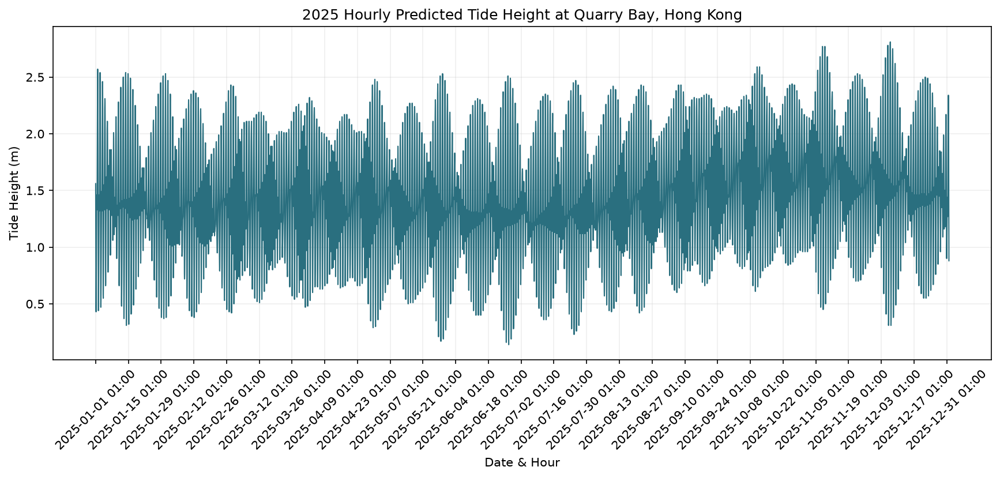

# Assignment 2: Hong Kong Daily Rainfall Visualization

This chart shows daily rainfall data at Hong Kong Observatory, from data.gov.hk.

Data source: https://data.weather.gov.hk/weatherAPI/cis/csvfile/HKO/ALL/daily_HKO_RF_ALL.csv

This plot only shows daily total rainfall values. It hides wind speed, humidity and the geographic distribution of rain across Hong Kong.
