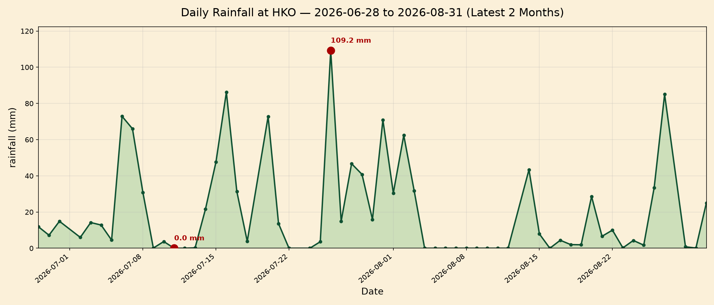

# Daily rain at HKO
This project visualises daily rainfall recorded at the Hong Kong Observatory. Rainfall is a natural weather phenomenon that changes day by day, and these measured numbers show how much rain fell over two consecutive months. I chose rainfall data because it shows clear variation between dry and wet days.

The dataset comes from Hong Kong Observatory open data.
Source link: https://data.weather.gov.hk/
The committed CSV file contains 60 rows. Each row represents one calendar day. The value shows total rainfall in millimetres. The raw file is saved inside the data folder so the script works offline.

This line chart plots rainfall height against date. The green area fills the space below the rainfall line to make changes easier to read. The chart hides fine details such as hourly rainfall; it only keeps total daily rainfall and loses the timing of rain within each day.

Run the visualisation script:
uv run plot.py
